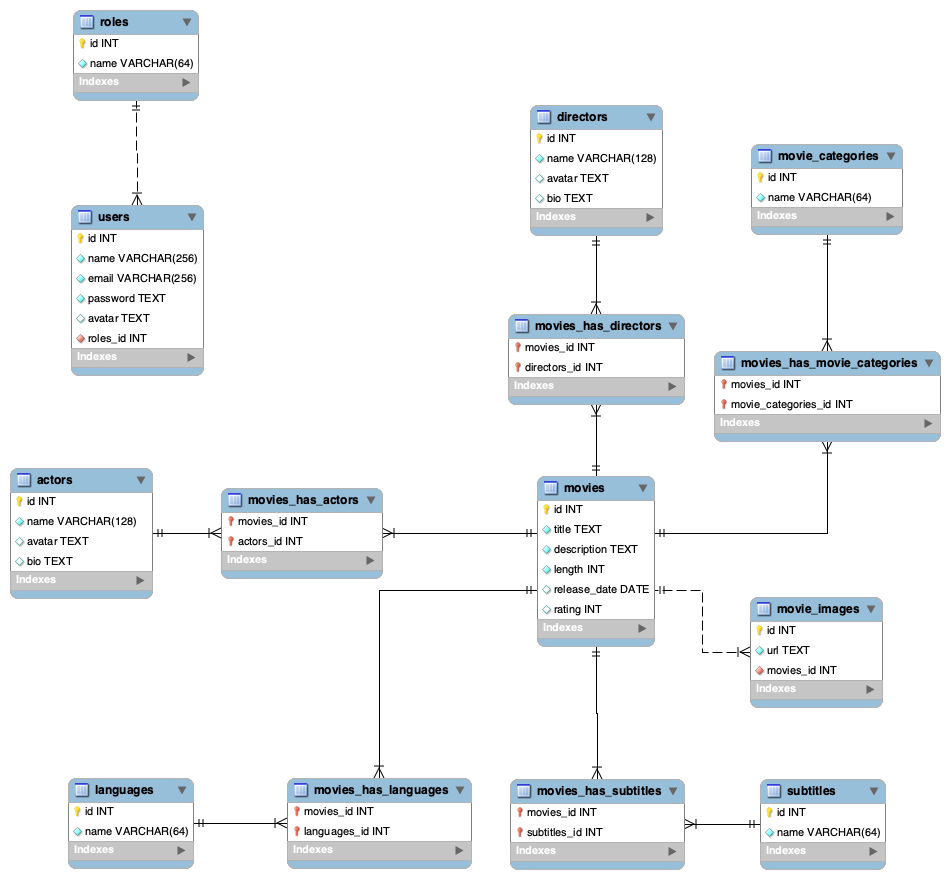

# DH Liteflix
DH Liteflix es una plataforma de Video on Demand (VOD) que ofrece una amplia selección de películas. Nuestro servicio permite a los usuarios acceder a contenido audiovisual de alta calidad a través de streaming.

## Audiencia Objetivo
Nuestra plataforma está dirigida principalmente a:
- Jóvenes y adultos entre 18-45 años
- Amantes del cine
- Usuarios que buscan una experiencia de entretenimiento personalizada
- Personas que valoran la flexibilidad de ver contenido cuando y donde quieran

## Ajuste de la Oferta
Para adaptarnos a nuestro público objetivo, ofrecemos:
- Interfaz intuitiva y moderna
- Catálogo diverso de contenido
- Recomendaciones personalizadas
- Calidad de streaming adaptativa
- Experiencia multiplataforma

## Sobre Mi
Mi Nombre es Erik Andrey Bejarano Sanchez, soy Tecnologo en analisis y desarrollo de sistemas de informacion, Soy de Colombia pero vivo en Argentina, desde los 15 años desarrollo software.

## Referencias
- **Netflix:** Es una plataforma VOD que ofrece sus servios a nivel mundial, los cuales son peliculas y series. [Link](https://www.netflix.com)
- **Disney++:** Es al plataforma de VOD de Disney. [Link](https://www.disneyplus.com)
- **Max:** Es la Plataforms de VOD de HBO. [Link](https://www.max.com)
- **Amazon Prime:** Es la plataforma de VOD de Amazone. [Link](https://www.primevideo.com)
- **Paramount+:** Es la plataforma de VOD de Paramount. [Link](https://www.paramountplus.com)

## DER

[Trello](https://trello.com/b/tKGuYbOO/liteflix)